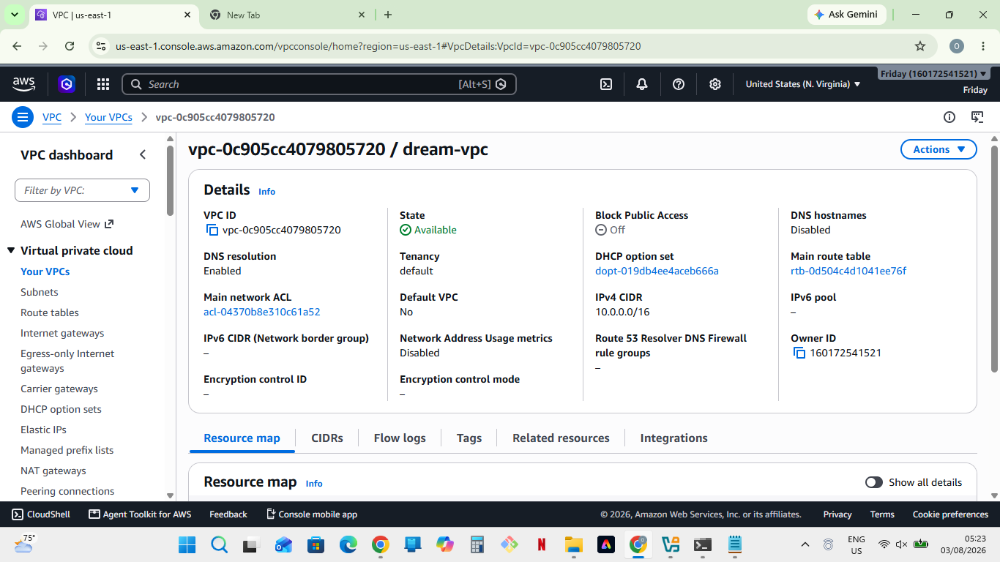
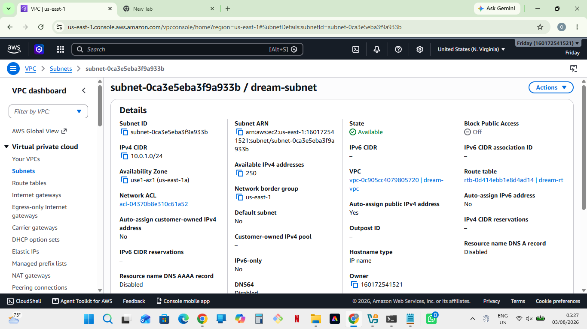
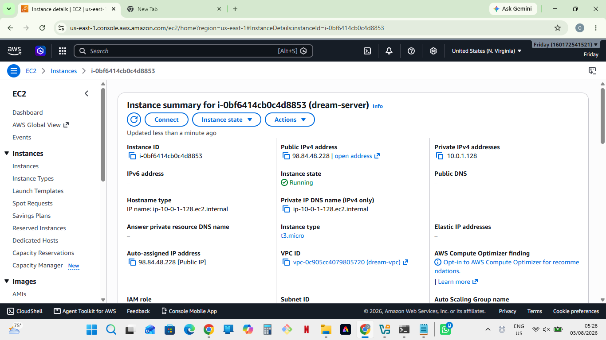
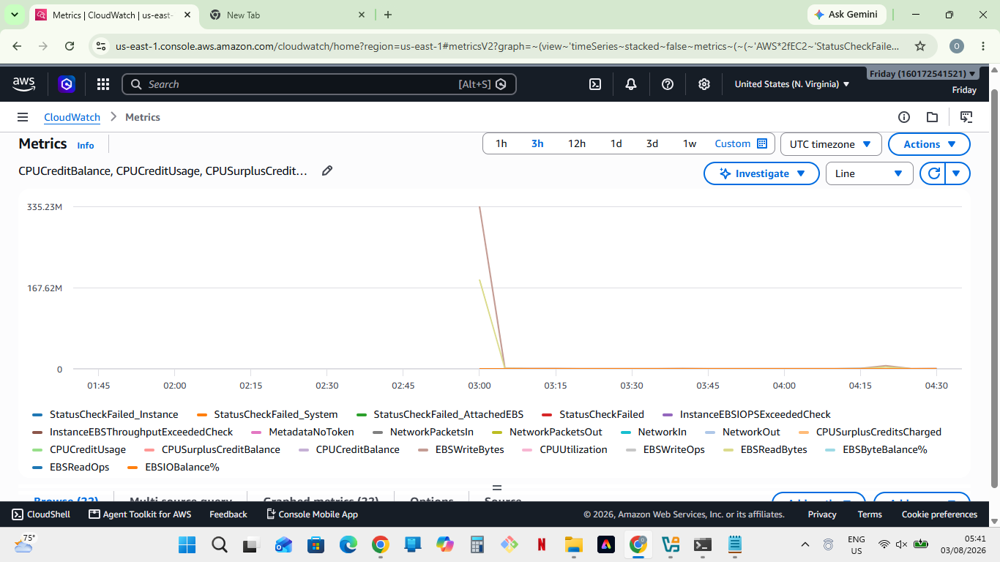
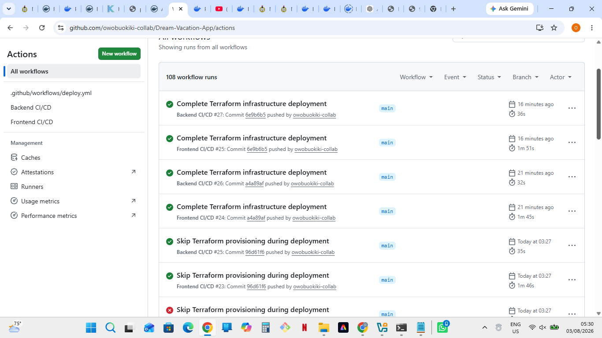

# Dream Vacation App - Infrastructure Deployment with Terraform & CI/CD

## Project Overview

This project provisions AWS infrastructure using Terraform and deploys the Dream Vacation App automatically using GitHub Actions.

The infrastructure includes:

- Custom VPC
- Public Subnet
- Internet Gateway
- Route Table
- Security Group
- EC2 Instance
- Docker & Docker Compose installation
- CloudWatch monitoring
- Automated deployment with GitHub Actions

---

# Architecture

GitHub Repository
        │
        ▼
GitHub Actions CI/CD
        │
        ▼
Terraform
        │
        ▼
AWS Infrastructure
    ├── VPC
    ├── Public Subnet
    ├── Internet Gateway
    ├── Route Table
    ├── Security Group
    └── EC2 Instance
        │
        ▼
Docker Compose
        │
        ▼
Dream Vacation App

---

# Technologies Used

- Terraform
- AWS EC2
- AWS VPC
- AWS CloudWatch
- Docker
- Docker Compose
- GitHub Actions
- Ubuntu Server

---

# Infrastructure Created

## VPC

```hcl
resource "aws_vpc" "dream_vpc" {
  cidr_block = "10.0.0.0/16"

  tags = {
    Name = "dream-vpc"
  }
}
```

---

## Public Subnet

```hcl
resource "aws_subnet" "dream_subnet" {
  vpc_id                  = aws_vpc.dream_vpc.id
  cidr_block              = "10.0.1.0/24"
  availability_zone       = "us-east-1a"
  map_public_ip_on_launch = true

  tags = {
    Name = "dream-subnet"
  }
}
```

---

## Security Group

```hcl
resource "aws_security_group" "dream_sg" {
  name        = "dream-sg"
  description = "Allow SSH and HTTP"
  vpc_id      = aws_vpc.dream_vpc.id

  ingress {
    from_port   = 22
    to_port     = 22
    protocol    = "tcp"
    cidr_blocks = ["0.0.0.0/0"]
  }

  ingress {
    from_port   = 80
    to_port     = 80
    protocol    = "tcp"
    cidr_blocks = ["0.0.0.0/0"]
  }

  ingress {
    from_port   = 3000
    to_port     = 3000
    protocol    = "tcp"
    cidr_blocks = ["0.0.0.0/0"]
  }

  ingress {
    from_port   = 3001
    to_port     = 3001
    protocol    = "tcp"
    cidr_blocks = ["0.0.0.0/0"]
  }
}
```

---

## EC2 Instance

```hcl
resource "aws_instance" "dream_server" {
  ami           = data.aws_ami.ubuntu.id
  instance_type = "t3.micro"
  subnet_id     = aws_subnet.dream_subnet.id
  key_name      = "dream-key"

  vpc_security_group_ids = [
    aws_security_group.dream_sg.id
  ]

  tags = {
    Name = "dream-server"
  }
}
```

---

## CloudWatch

CloudWatch was used to monitor the EC2 instance CPU utilization.

Example Terraform snippet:

```hcl
resource "aws_cloudwatch_metric_alarm" "cpu_alarm" {
  alarm_name          = "HighCPUUtilization"
  comparison_operator = "GreaterThanThreshold"
  evaluation_periods  = 2
  metric_name         = "CPUUtilization"
  namespace           = "AWS/EC2"
  period              = 300
  statistic           = "Average"
  threshold           = 80

  alarm_description = "Alarm when CPU exceeds 80%"
}
```

---

# CI/CD Pipeline

GitHub Actions automates:

- Terraform Init
- Terraform Plan
- Terraform Apply
- EC2 Deployment
- Docker Compose Deployment

Workflow:

```
Git Push
    ↓
GitHub Actions
    ↓
Terraform Apply
    ↓
AWS Infrastructure Created
    ↓
SSH to EC2
    ↓
Docker Compose Up
    ↓
Dream Vacation App Running
```

---

# Deployment

Clone the repository

```bash
git clone https://github.com/yourusername/Dream-Vacation-App.git
```

Navigate into Terraform

```bash
cd terraform
```

Initialize Terraform

```bash
terraform init
```

Plan Infrastructure

```bash
terraform plan
```

Deploy Infrastructure

```bash
terraform apply
```

---

# Application

The application runs inside Docker containers using Docker Compose.

Frontend

```
http://<EC2-PUBLIC-IP>:3000
```

Backend

```
http://<EC2-PUBLIC-IP>:3001
```

---

# AWS Resources Created

- 1 VPC
- 1 Public Subnet
- 1 Internet Gateway
- 1 Route Table
- 1 Route Table Association
- 1 Security Group
- 1 EC2 Instance
- CloudWatch Monitoring

---

# Assessment Deliverables

## Terraform Networking

✔ Included above

---

## Terraform EC2

✔ Included above

---

## Terraform CloudWatch

✔ Included above

---

## Screenshot 1

### VPC and Public Subnet





---

## Screenshot 2

### EC2 Instance Running



---

## Screenshot 3

### Dream Vacation App Running in Browser


---

## Screenshot 4

### CloudWatch CPU Metrics / Alarm



---

## Screenshot 5

### GitHub Actions Successful CI/CD Pipeline



---

# Project Status

✔ Infrastructure automated using Terraform

✔ AWS networking configured

✔ EC2 deployed successfully

✔ Docker installed automatically

✔ Dream Vacation App deployed

✔ CloudWatch monitoring enabled

✔ CI/CD pipeline configured with GitHub Actions

---

# Author

**Owobu Okiki Osemudiame**

DevOps Engineer

